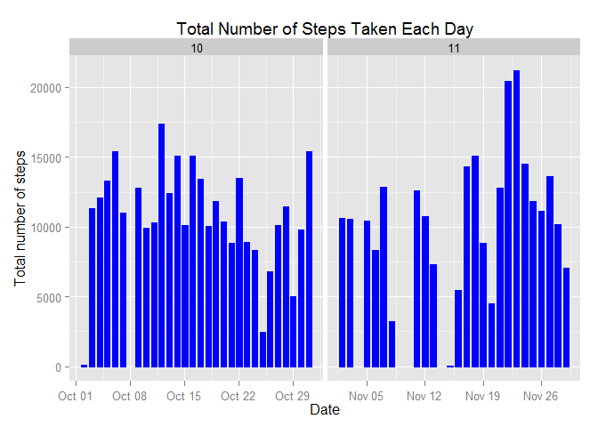
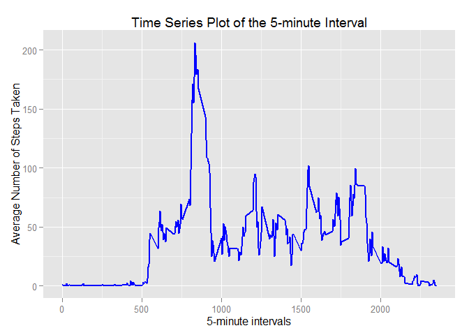
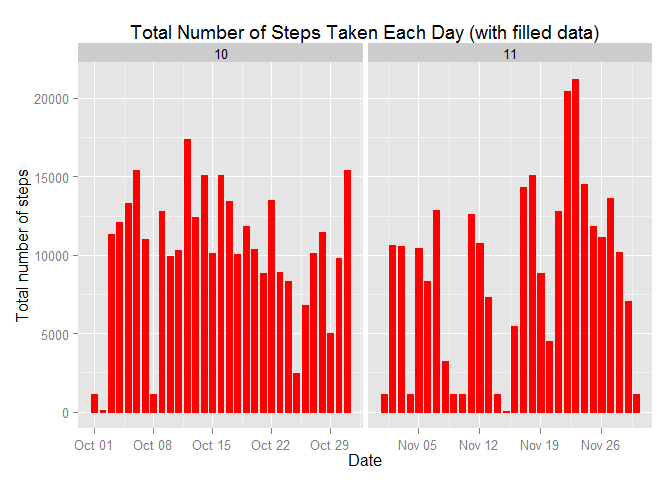
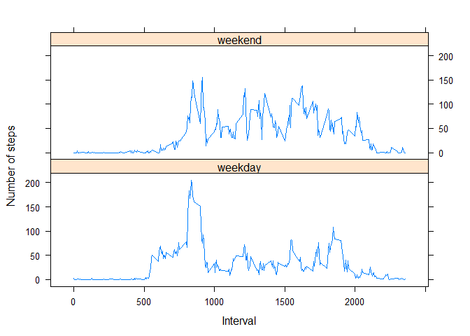

# Reproducible Research: Peer Assessment 1
## Init

```r
echo = TRUE #make code visible
```
## Loading and preprocessing the data

```r
unzip("activity.zip") #process the data
data <- read.csv("activity.csv", colClasses = c("integer", "Date", "factor"))
data$month <- as.numeric(format(data$date, "%m"))
fixNA <- na.omit(data)
rownames(fixNA) <- 1:nrow(fixNA)
library(ggplot2)
```


## What is mean total number of steps taken per day?
1. Calculate the total number of steps taken per day


```r
totalSteps <- aggregate(fixNA$steps, list(Date = fixNA$date), FUN = "sum")
```

2. Make a histogram of the total number of steps taken each day


```r
ggplot(fixNA, aes(date, steps)) + geom_bar(stat = "identity", colour = "blue", fill = "blue", width = 0.7) + facet_grid(. ~ month, scales = "free") + labs(title = "Total Number of Steps Taken Each Day", x = "Date", y = "Total number of steps")
```

 

3. Calculate and report the mean and median of the total number of steps taken per day
Mean total number of steps taken per day:


```r
totalSteps <- aggregate(fixNA$steps, list(Date = fixNA$date), FUN = "sum")$x
mean(totalSteps)
```

```
## [1] 10766.19
```

Median total number of steps taken per day:


```r
median(totalSteps)
```

```
## [1] 10765
```

## What is the average daily activity pattern?
1. Make a time series plot (i.e. type = "l") of the 5-minute interval (x-axis) and the average number of steps taken, averaged across all days (y-axis)


```r
avgSteps <- aggregate(fixNA$steps, list(interval = as.numeric(as.character(fixNA$interval))), FUN = "mean")
names(avgSteps)[2] <- "meanOfSteps"

ggplot(avgSteps, aes(interval, meanOfSteps)) + geom_line(color = "blue", size = 0.8) + labs(title = "Time Series Plot of the 5-minute Interval", x = "5-minute intervals", y = "Average Number of Steps Taken")
```

 

2. Which 5-minute interval, on average across all the days in the dataset, contains the maximum number of steps?


```r
avgSteps[avgSteps$meanOfSteps == max(avgSteps$meanOfSteps), ]
```

```
##     interval meanOfSteps
## 104      835    206.1698
```

## Inputing missing values
1. Calculate and report the total number of missing values in the dataset (i.e. the total number of rows with NAs)


```r
sum(is.na(data))
```

```
## [1] 2304
```

2. Devise a strategy for filling in all of the missing values in the dataset. The strategy does not need to be sophisticated. For example, you could use the mean/median for that day, or the mean for that 5-minute interval, etc.
* Use the median of 5-minute interval to fill in the blank


```r
medSteps <- aggregate(fixNA$steps, list(interval = as.numeric(as.character(fixNA$interval))), FUN = "median")
names(medSteps)[2] <- "medianOfSteps"
```

3. Create a new dataset that is equal to the original dataset but with the missing data filled in.


```r
filledData <- data 
for (i in 1:nrow(filledData)) {
    if (is.na(filledData$steps[i])) {
        filledData$steps[i] <- medSteps[which(filledData$interval[i] == medSteps$interval), ] $medianOfSteps
    }
}
```

4. Make a histogram of the total number of steps taken each day and Calculate and report the mean and median total number of steps taken per day. Do these values differ from the estimates from the first part of the assignment? What is the impact of imputing missing data on the estimates of the total daily number of steps?


```r
library(ggplot2)
ggplot(filledData, aes(date, steps)) + geom_bar(stat = "identity",colour = "red", fill = "red",
                                             width = 0.7) + facet_grid(. ~ month, scales = "free") + labs(title = "Total Number of Steps Taken Each Day (with filled data)", x = "Date", y = "Total number of steps")
```

 

Evaluate the difference and impact.
* new mean and median


```r
newTotalSteps <- aggregate(filledData$steps, 
                           list(Date = filledData$date), 
                           FUN = "sum")$x
newMean <- mean(newTotalSteps)
newMean
```

```
## [1] 9503.869
```

```r
newMedian <- median(newTotalSteps)
newMedian
```

```
## [1] 10395
```

* Compare with the old values


```r
oldMean <- mean(totalSteps)
oldMedian <- median(totalSteps)
newMean - oldMean
```

```
## [1] -1262.32
```

```r
newMedian - oldMedian
```

```
## [1] -370
```

This strategy reduce both the mean and the median of the data.

## Are there differences in activity patterns between weekdays and weekends?
1. Create a new factor variable in the dataset with two levels - "weekday" and "weekend" indicating whether a given date is a weekday or weekend day.


```r
filledData$weekdays <- factor(format(filledData$date, "%A"))
levels(filledData$weekdays) <- list(weekday = c("Monday", "Tuesday",
                                             "Wednesday", 
                                             "Thursday", "Friday"),
                                 weekend = c("Saturday", "Sunday"))
levels(filledData$weekdays)
```

```
## [1] "weekday" "weekend"
```

2. Make a panel plot containing a time series plot (i.e. type = "l") of the 5-minute interval (x-axis) and the average number of steps taken, averaged across all weekday days or weekend days (y-axis).


```r
newAvgSteps <- aggregate(filledData$steps, 
                      list(interval = as.numeric(as.character(filledData$interval)), 
                           weekdays = filledData$weekdays),
                      FUN = "mean")
names(newAvgSteps)[3] <- "newMeanOfSteps"
library(lattice)
xyplot(newAvgSteps$newMeanOfSteps ~ newAvgSteps$interval | newAvgSteps$weekdays, 
       layout = c(1, 2), type = "l", 
       xlab = "Interval", ylab = "Number of steps")
```

 
